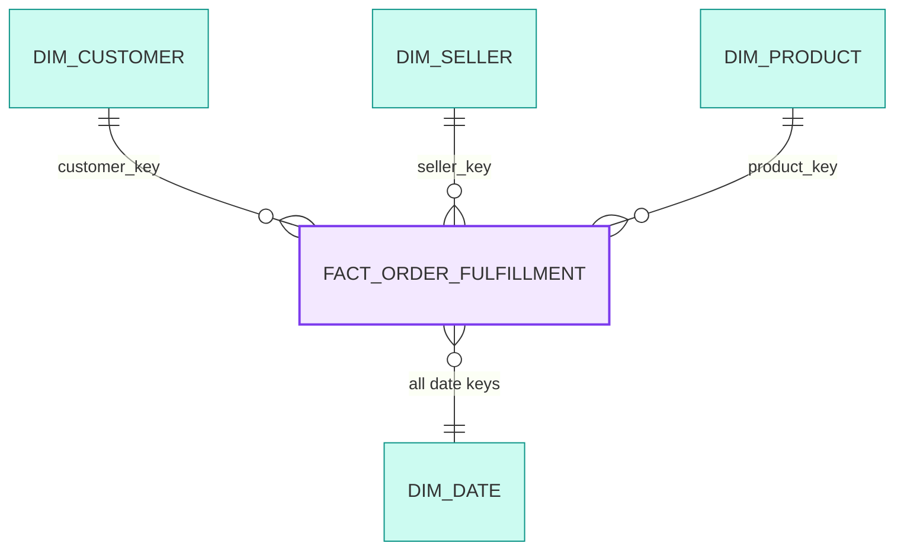
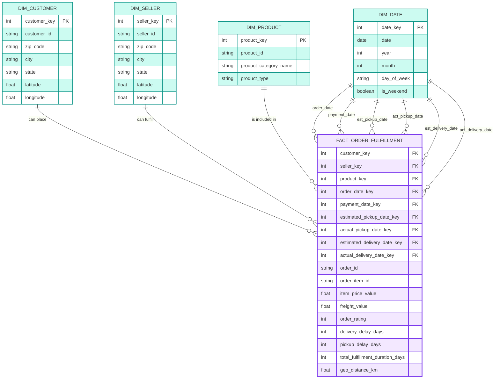

# Dimensional Modeling
Use Kimball Methodology to come out a Star schema

## Star Schema Overview

## 1 - Select Business Process
* **Focus** Online Merchant and Order Fullfilment
* **Process** Order Fullfillment Process
* **Challenge** Orders are delivered late than estimation
* **Analytics Goal** Identify bottleneck in fullfilment, seller and carrier Performance Review

## 2 - Declare the Grain
* order fullfullment transaction

## 3 - Identify Dimensions
* **Who** customer, seller
* **What** product, product type, product freight, and product value
* **When** Delivery Date, Pick Up Date, Purchase Date, Order Date, Estimated delivery
* **Where** customer state, city, seller state, city

* **==Important==**
    * 1 order have only 1 carrier 
    * 1 order have multiple items by different sellers
    * 1 order have multiple reviews (for each item), take the latest review score.

        | number_of_reviews | count_of_orders |
        | :---: | :---: |
        | 1 | 98126 |
        | 2 | 543 |
        | 3 | 4 |

    * each order is assigned to a unique customer_id. This means that the same customer will get different ids for different orders. The purpose of having a customer_unique_id on the dataset is to allow you to identify customers that made repurchases at the store. Otherwise you would find that each order had a different customer associated with.
    * geolocation zip code contains only first 5 digits and many duplciated zip code with different lat and longt
    * the order item table, The order_id = 00143d0f86d6fbd9f9b38ab440ac16f5 has 3 items (same product). Each item has the freight calculated accordingly to its measures and weight. To get the total freight value for each order you just have to sum.
        * The total order_item value is: 21.33 * 3 = 63.99
        * The total freight value is: 15.10 * 3 = 45.30
        * The total order value (product + freight) is: 45.30 + 63.99 = 109.29

## 4 - Identify Facts
measure the date differences
* order delivery performance: delivery delay, pickup delay, delivery delay, customer rating
* the seller performance: shipping delay
* one fact table containing all the order and seller transactions

## 5 - Managing SCD
SCD Type2 for DIM_CUSTOMER, DIM_SELLER
SCD Type1 for DIM_PRODUCT as product category will rename instead of moving to new category

## Final Dimensional Model

fact_order_fulfillment
----------------------
-- Foreign Keys (Dimensions)
customer_key (FK)
seller_key (FK)
product_key (FK)

-- Role-Playing Date Keys (Milestones)
order_date_key (FK to dim_date)
payment_date_key (FK to dim_date)
estimated_pickup_date_key (FK to dim_date)
actual_pickup_date_key (FK to dim_date)
estimated_delivery_date_key (FK to dim_date)
actual_delivery_date_key (FK to dim_date)

-- Degenerate Dimensions
order_id
order_item_id (To handle multiple quantities/items)

-- Numeric Facts (Metrics)
item_price_value
freight_value
order_rating (Can be allocated to line items or handled via a junk dimension)
order_status

-- Calculated Lag Facts (Can be materialized or calculated in BI view)
delivery_delay_days (actual_delivery - estimated_delivery)
pickup_delay_days (actual_pickup - estimated_pickup)
total_fulfillment_duration_days (actual_delivery - order_date)
geo_distance_km

dimension table

dim_customer
------------
customer_key (PK)
customer_id (Natural Key)
zip_code
city
state
latitude
longitude

dim_seller
----------
seller_key (PK)
seller_id (Natural Key)
zip_code
city
state
latitude
longitude

dim_product
-----------
product_key (PK)
product_id (Natural Key)
product_category_name
product_type

dim_date
--------
date_key (PK)
date (YYYY-MM-DD)
year
month
day_of_week
is_weekend

## Detailed Star Schema

