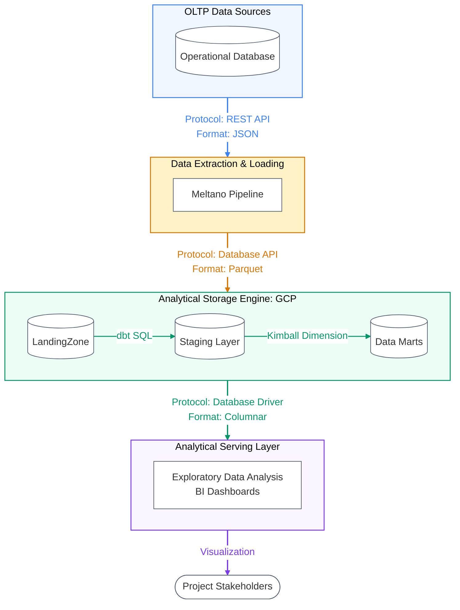

# DSAI Chohort 5 Module 2 Group Project

## Data Engineering and EDA
This project applies core Data Engineering principles alongside Exploratory Data Analysis (EDA) to solve real-world e-commerce challenges using the Olist dataset. 

The pipeline follows a structured data lifecycle, transitioning raw data through a Medallion Architecture into clean Kimball-style Dimensional Models (Facts and Dimensions) optimized for business intelligence and deep analytical exploration.

## Team Members:
*in alphabetical order by last name*

* Li Zhongyi (Ethan)
* Lin Minghui (Reeve)
* Mao Jianwen (Tony)
* Nainar Mohideen (Nainar)
* Wang Her Suen (Tom)
* Yang Shicong (Shicong)

## Problem Statements

Olist’s market competitiveness and customer retention are currently threatened by recurring delivery delays across its unified logistics network in Brazil. 

The core operational challenge lies in the team's inability to isolate whether these bottlenecks occur during initial seller processing hours or during carrier transit. 

To protect customer loyalty and maintain operational continuity, Olist needs to analyze transit days variance, seller processing lag, and regional late severity scores. 

Pinpointing these exact failure points will allow the operations team to establish a concrete governance framework, enforce strict carrier service level agreements, and hold low performing sellers accountable without disrupting daily supply chain flows.

| Project Topic | Context | Problem Statement | Analysis | Business Outcome |
| :--- | :--- | :--- | :--- | :--- |
| **Delivery Performance Optimization** | Olist connects small businesses across Brazil through a unified logistics network, managing multiple shipping carriers and thousands of independent sellers. | Delivery delays hurt customer retention, but the operations team cannot isolate whether delays happen during seller fulfillment or carrier transit. | • Transit days variance • Seller processing lag (hours) • Late severity score per region | **Market Competitiveness & Operational Continuity:** Secures Olist’s market positioning by protecting customer retention. Establishes a concrete governance framework to hold low-performing carriers accountable via SLAs and penalize bottleneck sellers without disrupting daily supply chain flows. |

---

## Solution Overview

---

## 🛠️ Data Engineering (The Pipeline)
* **Data Ingestion & Storage:** Establishing the landing zone for raw operational data into the **Bronze** warehouse layer.
* **Data Warehouse Design:** Enforcing the Kimball framework by designing dedicated Fact and Dimension tables, and arrive at star schema.
* **ELT Pipeline (dbt):** Processing, cleaning, and normalizing data into **Silver** models before building the final **Gold** layer.

## 📊 Exploratory Data Analysis (The Insights)
* **Data Quality Validation:** Writing profiling scripts to ensure data types match, null boundaries are respected, and data engineering logic functions correctly under real-world scenarios.
* **Data Analysis:** Investigating distributions, correlation metrics (e.g., delivery delay impact on review scores), and behavior variance across distinct regions.
* **Business Insights:** Converting modeled tables into structured visualizations, dashboards, and reports that directly inform the strategies of the Accountable (A) project stakeholders.

---

## Project Work Breakdown Structure (WBS) & Progress Tracker

| WBS Code | Phase / Work Package | Task Description | Technical Deliverable | Status |
| :--- | :--- | :--- | :--- | :--- |
| **1.0** | **Project Initiation** | **Foundation and environment configuration** | **Infrastructure Baseline** | - |
| 1.1 | Environment Setup | Initialize GitHub repository, configure local dbt profiles, and establish active data warehouse connections. | Shared Git repository and active warehouse connection | [X] |
| 1.2 | Source Data Preparation | Prepare raw operational data tables in Supabase. | [Source Data in Supabase](1.2-supabase-setup.md) | [X] |
| 1.3 | Topic Selection | Choose and finalize the specific business problem statement from the four proposed Olist tracks. | Delivery Delay Analysis | [X] |
| **2.0** | **Data Pipeline** | **Building the Bronze, Silver, and Gold data layers** | **Data Engineering Track** | - |
| 2.1 | Data Ingestion (Meltano) | Configure Meltano pipelines to extract from Supabase and Load into GCP. | [Meltano EL notebook](2.1-meltano.ipynb) | [X] |
| 2.2 | Data Warehouse (Star Schema) | Organize data into facts and dimension tables, adopt SCD Type 1 and Type 2 | [Dimension Model](2.2-dimension-model.md)| [X] |
| 2.3 | Data Mart (dbt) |  Transform raw data into organized tables using dbt, remove deduplicate records, clean null values, and standardize basic data types. | [dbt](2.3-dbt.ipynb) | [X] |
| 2.4 | Data Quality Testing | Deploy dbt tests for uniqueness, non null values, and referential integrity while auto generating the data catalog. Execute analytical data profiling scripts to stress test dimensional boundaries and validate engineering logic | [lineage diagram](2.4-dbt-doc.md) | [X] |
| **3.0** | **Exploratory Data Analysis (EDA)** | **Validating quality and extracting analytical trends** | **Analytics Track** | - |
| 3.1 | Data Analysis | Investigate data distributions, calculate target metric correlations, and analyze regional behavior variances. | [Jupyter Notebooks](3.1-olist-fulfillment-eda.ipynb) | [X] |
| 3.2 | Deep Dive Business Insights | Extract actionable intelligence that explicitly answers the core metrics of the chosen problem statement. | [Documented analytical insights](3.2-business-insights.md) | [X] |
| **4.0** | **Documentation and Presentation** | **Translating data models into stakeholder value** | **Presentation & Interface** | - |
| 4.1 | Project Documentation | Finalize the comprehensive GitHub README outlining the system architecture, dbt models, and analytical outcomes. | [Project Document](README.md) | [X] |
| 4.3 | Stakeholder Presentation | Present architecture and recommendations to executives. | Final presentation deck | [ ] |

## Important Decisions

### How to handle changes

changes can happen to
* new order
* order status change
* new buyer/seller
* update to the seller

### Meltano Replication Methods
it's doing a full table replication from tap to target, by default.
overall it works and dbt can manage the change later. 
but for data traffic congestion, incremental method can be used for selected tables

### DBT
SCD Type 2
Overwriting

### Meltano choice of table to ingest

To effectively analyse delays the following four tables in the schema are needed

---

#### 1. olist_orders_dataset
This is the primary table containing the timestamps required to map the lifecycle of an order and split the delivery timeline into measurable stages.

* **`order_id`**: Text (Primary Key) — Used to join with order items and payments.
* **`customer_id`**: Text — Used to join with the customer dataset to extract destination regions.
* **`order_purchase_timestamp`**: Timestamp — The initial point when the customer placed the order.
* **`order_approved_at`**: Text/Timestamp — The baseline marker representing when the order is ready for seller fulfillment.
* **`order_delivered_carrier_date`**: Text/Timestamp — The exact handoff point from the seller to the shipping carrier. **(Critical for splitting seller lag from carrier transit)**.
* **`order_delivered_customer_date`**: Text/Timestamp — The actual arrival date at the customer's destination.
* **`order_estimated_delivery_date`**: Timestamp — The promised delivery date. **(Critical for calculating late severity scores)**.

#### 2. olist_order_items_dataset
This table links specific items within an order to their respective sellers and establishes fulfillment deadlines.

* **`order_id`**: Text — Links back to the main order details.
* **`seller_id`**: Text — Identifies the specific seller responsible for the item fulfillment.
* **`shipping_limit_date`**: Timestamp — The contractual deadline the seller had to hand over the package to the carrier.

#### 3. olist_customers_dataset
This table provides the geographic context needed to evaluate regional performance and destination bottlenecks.

* **`customer_id`**: Text (Primary Key) — Links to the main orders table.
* **`customer_city`**: Text — Destination city.
* **`customer_state`**: Text — Destination state. **(Essential for mapping late severity scores per region)**.

#### 4. olist_sellers_dataset
This table provides origin logistics data to identify if certain seller clusters experience localized operational bottlenecks.

* **`seller_id`**: Text (Primary Key) — Links to the order items table to isolate low performing sellers.
* **`seller_city`**: Text — Origin city of the shipment.
* **`seller_state`**: Text — Origin state of the shipment.

### 🔄 Handling Data Changes Over Time
To accurately support downstream statistical analysis, the pipeline must process daily source modifications (such as new orders or changing shipping tracking logs) without duplicating transaction metrics or losing historical context.

#### 1. Dimension Tables: Slowly Changing Dimensions (SCD)
For entities capturing descriptive properties that shift occasionally over time (e.g., a customer changing cities or a seller updating their registration state), the warehouse enforces **Slowly Changing Dimensions**:
* **SCD Type 1 (Overwrite):** Applied to simple operational parameters (e.g., a changed phone number or a product name correction) where tracking mutation timelines holds no analytic value.
* **SCD Type 2 (Historical Snapshots):** Utilizes `valid_from`, `valid_to`, and `is_current` boolean markers. When a customer or seller updates their demographic region, a new versioned row is inserted. This allows the **Dynamic Customer Segmentation** track to run reliable historical cohort analysis without data loss.

#### 2. Fact Tables: Transactional and Snapshot Consolidation
For core quantitative operations like `fct_orders`, the changing state (e.g., `processing` ➔ `shipped` ➔ `delivered`) is captured daily:
* **The Ingestion Delta:** Daily state mutations are incrementally loaded via **Meltano** into append-only tables inside **BigQuery Bronze**.
* **Silver Table Consolidation:** The pipeline isolates the single latest record status by deploying SQL window deduplication functions partitioned by primary key (`order_id`) and ordered by change chronologies (`updated_at DESC`).
* **Gold Table Upsert / Accumulating Snapshot:** The final fact layer aggregates state changes into a single row per order, populating sequential tracking milestones (e.g., `order_placed_at`, `carrier_pickup_at`, `delivered_at`). The order status acts as a **Degenerate Dimension** inside the table, allowing the **Customer Satisfaction Breakdown** track to perform rapid queries on order state correlation without performance degradation.

## Next Step

### Pipeline Orchestration

it's not included in this project yet.  Next step is to use an automation tool to manage the steps of your pipeline from start to finish.

Set up a schedule so your data updates and quality checks run automatically.
Options for scheduling include (not limited to):
* Orchestration tools (Dagster, Airflow, etc.) 
* Managed service (e.g., Google Cloud Composer) 
* Cron jobs
* CICD via GitHub Actions